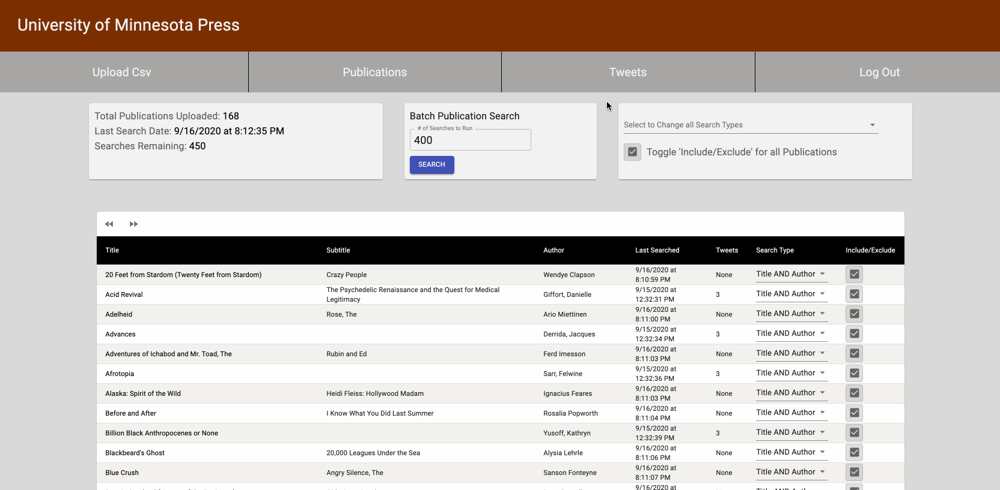

# University of Minnesota Press Twitter Widget

**Duration: 3 Weeks**

## Overview
This app is designed to find and display Twitter mentions of publications from the University of Minnesota Press. The app saves information about U of M Press publications in a database and generates search queries for Twitter's search API. The search results are displayed in a format that allows the admin to approve or reject the tweets. Approved tweets are available for integration on the U of M website. 



To see the fully functional application, please visit the [UMN PRESS TWITTER SEARCH APPLICATION](https://powerful-island-90935.herokuapp.com/)


## Usage

### Login
- Upon first visiting the webpage, the Login screen will be displayed with fields for Username and Password. 
- Enter the provided Username and Password into the field and Click ‘Sign In’ to log in to the application. Once logged in, the application redirects to the Publication Overview.  
- Select the Upload Csv tab within the Navigation bar to begin a new spreadsheet upload.


### Upload Csv
- If not already present, proceed to the Upload Csv page by selecting the ‘Upload Csv’ tab within the Navigation Bar.
- To Upload and Preview a CSV document, click the ‘Preview Csv File’ button. A local file browser window will appear, navigate to the desired csv file and choose ‘Open’ to preview it. 
- The data in the spreadsheet will be analyzed and displayed on a webpage within a table for review. Once reviewed, select ‘Accept’ if satisfactory or ‘Reject’ to start the process over. 
Once the spreadsheet is accepted, the application will redirect to the Publication Overview page.


### Search Overview
- The Publications tab displays the Twitter search history and provides options to refine the search parameters. 
- The standard Twitter Search API provides 450 searches within a 15 minute timeframe and can be expanded with different Enterprise account options. 
- By default, the search is configured to include only the title of a publication. Different combinations of the publication’s title, subtitle, and author are selectable with a drop-down menu on each row, all publication search types can be changed with the drop-down in the upper right panel of the page. 
- A toggle exists below this menu to switch between including or excluding the publications, which simplifies the process of customizing which books will be included in the search. 
Each publication in the table row has its own toggle to include or exclude that publication.


### Publication Item
- When selecting an individual publication item by its title, the page will redirect to display all of the undecided Tweet Mentions for that title. 
- Another search panel allows an individual search to be configured. 
- To select a Tweet to be Approved for review, click the Approve button. 
- To remove the Tweet from displaying on the results, select Reject. 
- A drop down menu to select the category for Approved, Rejected, or Undecided Tweets changes the view to show only tweets from those categories.


### Tweets Tab
- The Tweets tab on the navigation menu provides an overview of all the search results. 
- The page displays undecided Tweets ordered alphabetically by Publication title. 
- Approving or Rejecting a Tweet displays the next Tweet in the result list.
- At the bottom of the Tweets tab page is a button to ‘Delete All Unapproved Tweets’. 
This will permanently delete all undecided and rejected tweets from the database.
This is useful when using a deployment service with database row limits.
- Approved Tweets should automatically appear on their corresponding book page where the Twitter Widget (separate documentation) is set up.


## Development Setup
### Prerequisites

Before you get started, make sure you have the following software installed on your computer:

- [Node.js](https://nodejs.org/en/)
- [PostrgeSQL](https://www.postgresql.org/)


### Create database and tables

Create a new database called `umn_app`.\
To set up database tables use the 'database.sql' file located in the root directory or copy tables below.

```SQL
CREATE TABLE "user" (
    "id" SERIAL PRIMARY KEY,
    "username" VARCHAR (80) UNIQUE NOT NULL,
    "password" VARCHAR (1000) NOT NULL,
    "rate_limit" INT,
    "rate_limit_remaining" INT DEFAULT 450,
    "rate_limit_refresh" INT
);
CREATE TABLE "publication" (
    "id" SERIAL PRIMARY KEY,
    "title" VARCHAR (1000),
    "subtitle" VARCHAR (1000),
    "author1" VARCHAR (1000),
    "author2" VARCHAR (1000),
    "author3" VARCHAR (1000),
    "author4" VARCHAR (1000),
    -- last_searched defaults null so we can see that this publication has not been searched yet
    "last_searched" TIMESTAMP DEFAULT NULL,
    "include" BOOLEAN DEFAULT TRUE,
    "search_type" VARCHAR (10) DEFAULT 'T'
);
CREATE TABLE "tweet" (
    "id" SERIAL PRIMARY KEY,
    "publication_id" INT REFERENCES publication(id),
    "tweet_id" VARCHAR (100),
    "approved" BOOLEAN
);

```

If you would like to change the name your database to something else, you will need to update the name in the configuration object located on line 34 in `server/modules/pool.js`


### Lay of the Land

- `src/` contains the React application and its components
- `public/` contains static assets for the client-side
- `build/` after you build the project, contains the transpiled code from `src/` and `public/` that will be viewed on the production site
- `server/` contains the Express App

This code is also heavily commented. We recommend reading through the comments, getting a lay of the land, and becoming comfortable with how the code works before you start making too many changes. If you're wondering where to start, consider reading through component file comments in the following order:

- src/components
  - App/App
  - BookPage
  - CsvParser
  - PublicationItem
  - Publications
  - PublicationsTable
  - PublicationTable2
  - RegisterPage
  - UserPage/UserPage
  - TweetsPage
  - Widget


### Development Setup Instructions

- Run `npm install`
- Create a `.env` file at the root of the project:
- This file will need the following keys.

  ```
  SERVER_SESSION_SECRET= <Your Chosen Secret>
  BEARER_TOKEN= <access token provided by the Twitter api account>
  SEARCH_RESULT_LIMIT= <set in increments of 10 from 10-100 to limit how many results are returned from twitter searches>

  ```

  - To create a unique Server Secret visit [Here](https://passwordsgenerator.net/)
  - For Twitter BEARER_TOKEN visit [Here](https://developer.twitter.com/en/docs/authentication/oauth-2-0/bearer-tokens)

- Start postgres if not running already by using `brew services start postgresql`
- Run `npm run server`
- Run `npm run client`
- Navigate to `localhost:3000`


### Scheduling

Searches can be automatically scheduled by configuring the schedule.js module in the server directory. The module uses node-cron and the Cron format to determine when the searches take place. By default, the server will run 6 batches of 450 searches at 1:00, 1:20, 1:40, 2:00, 2:20, and 2:40 AM server time. Note that the server must be running for the search to take place.

- server
  - module
    - schedule.js
    

## Built With

JavaScript, React, Node.js, Express, PostgreSQL, Redux, Redux-Saga, Material-UI, Node-Cron, Papa Parse CSV Parser


## Acknowledgements

This App was developed by Ross Hutchens, Paul Joachim, Josh Maus, and Jason Stiff as part of the curriculum at Prime Digital Academy in Minneapolis, MN. 

We'd like to thank the University of Minnesota Press, and especially Maggie Sattler for the opportunity to work on such a unique problem. It was a great pleasure to help further their educational and engagement goals.

We'd also like to thank Twitter for making tweet data easily accessible to developers via their Developer Portal and their APIs. 

Finally, thanks go to our instructors and peers at [Prime Digital Academy](https://www.primeacademy.io) especially Mary Mosman and Dev Jana who equipped us with the skills and knowledge to make this application a reality.

## Support
If you have suggestions or issues, please email me at [jman985@gmail.com](www.google.com)